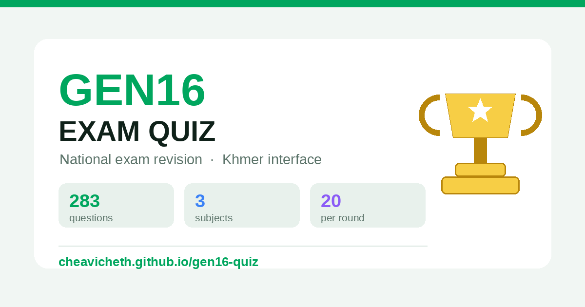

# GEN16 — EXAM QUIZ · ត្រៀមប្រឡងថ្នាក់ជាតិ

A single-file quiz game built to help Gen 16 students revise for the national
exam. Khmer interface, mobile first, works offline, with a shared leaderboard.

**Play:** https://cheavicheth.github.io/gen16-quiz/

---

## Subjects

| Subject | Questions | Topics |
|---|---|---|
| Cybersecurity | 117 multiple choice + 9 short answer | 8 |
| Software Engineering | 100 multiple choice | 7 |
| Advance Programming | 66 multiple choice | 8 |

**283 questions total.** Every question carries a one-line explanation in Khmer,
shown after you answer in Study mode and in the review list after every round.

## Modes

**ប្រកួត / Challenge** — the ranked mode. 20 random questions, 15 seconds each
with a countdown ring, options shuffled, streak counter running. Answers reveal
immediately and advance on their own. Only Challenge scores reach the leaderboard,
so every run is comparable.

**រៀន / Study** — self paced, no timer. Filter by topic, answer, and read the
explanation before moving on.

**ប្រឡង / Exam** — pick a topic and a question count, timed, with a full review
of everything you got wrong at the end.

**សំណួរខ្លី / Short answer** — flashcards with model answers. Cybersecurity only.

## Progress and rewards

- **Points** accumulate across every session and never reset.
  Challenge pays `correct × 10 + streak × 5`, plus `20` for finishing under three
  minutes — a perfect run is 320. Study and Exam pay `correct × 2`.
- **Six rank titles** ladder up with your points:

  | Points | Rank |
  |---|---|
  | 0 | ថ្មីថ្មោង |
  | 100 | អ្នកសិក្សា |
  | 300 | អ្នកប្រកួត |
  | 700 | អ្នកជំនាញ |
  | 1,500 | អ្នកជើងឯក |
  | 3,000 | មេជើងឯក |

- **Coverage tracking** — a bar per subject shows how many of its questions you
  have actually seen, and one on the player card covers all 283.
- **Personal bests** per subject, with a confetti burst when you beat one.

## Leaderboard

Four boards: one per subject, plus a combined **សរុប** ranking that adds your best
run in each subject together out of 60 and shows how many subjects you have
attempted. Everything sorts by score first, then by fastest time.

The top three stand on a podium with gold, silver and bronze medals — first place
takes a crown. Below the podium sits your own position and the exact gap to the
person above you.

## Design notes

- **No emoji.** Every icon is an inline SVG symbol defined once and referenced with
  `<use>` — 30 of them. Inline rather than an icon font so the app still works offline.
- **No CSS gradients.** The only gradients in the file are four SVG ones giving the
  medals and trophy their metallic finish.
- Light theme throughout. Kantumruy Pro for Khmer, Archivo Black for display,
  Space Grotesk for numbers.
- Buttons sit on a solid coloured edge and sink into it when pressed.

## How it works

`index.html` is entirely self contained — all 283 questions, styles, icons and
logic in one file. No build step, no dependencies, no framework. Open it from a
local copy and it runs offline; only the leaderboard and the web fonts need a
connection.

The leaderboard is optional. It posts to a Google Apps Script web app (`Code.gs`)
that appends rows to a private Google Sheet, with server-side validation on every
submission and 60-second caching on reads.

## Reusing this for another batch

1. Fork the repo and replace the question data in `index.html` (`Q_CYBER`, `Q_SE`, `Q_AP`).
2. For your own leaderboard: create a Google Sheet → Extensions → Apps Script →
   paste `Code.gs` → Deploy as a web app with access set to **Anyone** → paste the
   `/exec` URL into `API_URL` near the top of the script block in `index.html`.
3. Leave `API_URL` empty and everything except the leaderboard still works.

Adding a subject takes two edits — one entry in the `SUBJECTS` array in
`index.html`, and the matching id in `SUBJECTS` / `SUBJECT_IDS` in `Code.gs`.
Everything else (filters, challenge, boards, scoring out of `20 × subjects`)
follows automatically.

## Accuracy

Some answers and explanations were AI-assisted and **may contain errors**. Always
verify against your instructor and official course material before an exam.

Two known issues in the source paper: Software Engineering Q9 asks about
កុំព្យូទ័រ but every option describes a *thread*, and Q19 was ambiguous enough that
it was reworded to System Testing. Check both with your teacher.

## Attribution and takedown

Questions come from university revision handouts and published study guides.
Copyright in that material remains with its original owners; this project claims no
ownership of it. Not affiliated with EC-Council, any university, publisher, or
examination board.

Rights holders: please [open an issue](https://github.com/cheavicheth/gen16-quiz/issues)
and the material will be removed promptly.

## Privacy

Only the name a player types, their score, and their time are stored — for the
leaderboard. No email, phone number, or location is collected. Points, progress and
personal bests stay on the player's own device. Submitting a score is optional.

## Licence

Code is [MIT licensed](LICENSE). The licence covers the code only, not the question
content.
